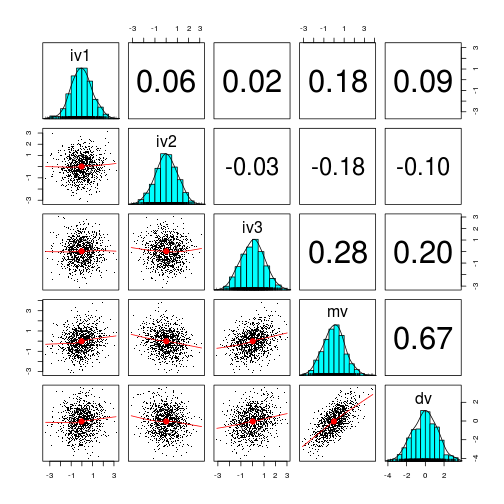

# Path Analysis Example


```r
library(psych)
library(lavaan)
```


## Simulate data
Let's simulate some data:

* three orthogonal predictor variables
* one mediator variable
* one dependent variable


```r
set.seed(1234)
N <- 1000
iv1 <- rnorm(N, 0, 1)
iv2 <- rnorm(N, 0, 1)
iv3 <- rnorm(N, 0, 1)
mv <- rnorm(N, .2 * iv1 + -.2 * iv2 + .3 * iv3, 1)
dv <- rnorm(N, .8 * mv, 1)
data_1 <- data.frame(iv1, iv2, iv3, mv, dv)
```


## Traditional examination of dataset
* Is a regression consistent with the model?


```r
summary(lm(mv ~ iv1 + iv2 + iv3, data_1))
```

```
## 
## Call:
## lm(formula = mv ~ iv1 + iv2 + iv3, data = data_1)
## 
## Residuals:
##     Min      1Q  Median      3Q     Max 
## -3.0281 -0.6863  0.0114  0.6697  3.1412 
## 
## Coefficients:
##             Estimate Std. Error t value Pr(>|t|)    
## (Intercept) -0.00945    0.03150   -0.30     0.76    
## iv1          0.19737    0.03163    6.24  6.4e-10 ***
## iv2         -0.19978    0.03216   -6.21  7.7e-10 ***
## iv3          0.29183    0.03113    9.38  < 2e-16 ***
## ---
## Signif. codes:  0 '***' 0.001 '**' 0.01 '*' 0.05 '.' 0.1 ' ' 1 
## 
## Residual standard error: 0.995 on 996 degrees of freedom
## Multiple R-squared: 0.144,	Adjusted R-squared: 0.141 
## F-statistic: 55.8 on 3 and 996 DF,  p-value: <2e-16 
## 
```


This is broadly similar to the equation predicting `mv`.


```r
summary(lm(dv ~ iv1 + iv2 + iv3 + mv, data_1))
```

```
## 
## Call:
## lm(formula = dv ~ iv1 + iv2 + iv3 + mv, data = data_1)
## 
## Residuals:
##     Min      1Q  Median      3Q     Max 
## -2.7484 -0.6547 -0.0359  0.6947  2.7185 
## 
## Coefficients:
##             Estimate Std. Error t value Pr(>|t|)    
## (Intercept)  -0.0410     0.0308   -1.33     0.18    
## iv1          -0.0449     0.0315   -1.43     0.15    
## iv2           0.0400     0.0320    1.25     0.21    
## iv3           0.0162     0.0317    0.51     0.61    
## mv            0.8250     0.0309   26.66   <2e-16 ***
## ---
## Signif. codes:  0 '***' 0.001 '**' 0.01 '*' 0.05 '.' 0.1 ' ' 1 
## 
## Residual standard error: 0.972 on 995 degrees of freedom
## Multiple R-squared: 0.45,	Adjusted R-squared: 0.448 
## F-statistic:  204 on 4 and 995 DF,  p-value: <2e-16 
## 
```


Given that the simulation is based on complete mediation, the true regression coefficients for the ivs are zero. The results of the multiple regression predicting the `dv` from the `iv`s and `mv` is consistent with this.

What are the basic descriptive statistics and intercorrelations?


```r
psych::describe(data_1)
```

```
##     var    n  mean   sd median trimmed  mad   min  max range  skew
## iv1   1 1000 -0.03 1.00  -0.04   -0.03 0.95 -3.40 3.20  6.59 -0.01
## iv2   2 1000  0.01 0.98   0.01    0.02 0.97 -3.12 3.17  6.29 -0.07
## iv3   3 1000  0.03 1.01   0.06    0.03 1.06 -3.09 3.02  6.12  0.01
## mv    4 1000 -0.01 1.07   0.02   -0.02 1.03 -3.12 3.82  6.94  0.07
## dv    5 1000 -0.05 1.31  -0.03   -0.04 1.37 -3.99 3.53  7.53 -0.03
##     kurtosis   se
## iv1     0.25 0.03
## iv2    -0.07 0.03
## iv3    -0.21 0.03
## mv      0.14 0.03
## dv     -0.17 0.04
```

```r
pairs.panels(data_1, pch='.')
```

 


## M1 Fit Path Analysis model


```r
m1_model <- '
dv ~ mv
mv ~ iv1 + iv2 + iv3
'

m1_fit <- sem(m1_model, data=data_1)
```


Are the regression coefficients the same?


```r
parameterestimates(m1_fit)
```

```
##    lhs op rhs    est    se      z pvalue ci.lower ci.upper
## 1   dv  ~  mv  0.815 0.029 28.490      0    0.759    0.871
## 2   mv  ~ iv1  0.197 0.032  6.253      0    0.136    0.259
## 3   mv  ~ iv2 -0.200 0.032 -6.224      0   -0.263   -0.137
## 4   mv  ~ iv3  0.292 0.031  9.394      0    0.231    0.353
## 5   dv ~~  dv  0.944 0.042 22.361      0    0.861    1.026
## 6   mv ~~  mv  0.986 0.044 22.361      0    0.900    1.073
## 7  iv1 ~~ iv1  0.994 0.000     NA     NA    0.994    0.994
## 8  iv1 ~~ iv2  0.055 0.000     NA     NA    0.055    0.055
## 9  iv1 ~~ iv3  0.016 0.000     NA     NA    0.016    0.016
## 10 iv2 ~~ iv2  0.962 0.000     NA     NA    0.962    0.962
## 11 iv2 ~~ iv3 -0.035 0.000     NA     NA   -0.035   -0.035
## 12 iv3 ~~ iv3  1.024 0.000     NA     NA    1.024    1.024
```


All the coefficients are in the ball park of what is expected.

Does the model provide a good fit?


```r
fitmeasures(m1_fit)
```

```
##             chisq                df            pvalue    baseline.chisq 
##             3.654             3.000             0.301           753.212 
##       baseline.df   baseline.pvalue               cfi               tli 
##             7.000             0.000             0.999             0.998 
##              logl unrestricted.logl              npar               aic 
##         -7045.596         -7043.769             6.000         14103.191 
##               bic            ntotal              bic2             rmsea 
##         14132.638          1000.000         14113.582             0.015 
##    rmsea.ci.lower    rmsea.ci.upper      rmsea.pvalue              srmr 
##             0.000             0.057             0.899             0.011 
```


* The fitted model should provide a good fit because the fitted model is identical to the model used to simulate the data.
* In this case, the p-value and the fit measures are consistent with the data being generated from the model specified.


## Calculate and test indirect effects


```r
m2_model <- '
    dv ~ b1*mv
    mv ~ a1*iv1 + a2*iv2 + a3*iv3
    
    # indirect effects
    iv1_mv := a1*b1
    iv2_mv := a2*b1
    iv3_mv := a3*b1
'

m2_fit <- sem(m2_model, data=data_1)
```


* Note that I needed to name effects before I could define the indirect effect as the product of two effects using `:=` notation.


```r
parameterestimates(m2_fit, standardize=TRUE)
```

```
##       lhs op   rhs  label    est    se      z pvalue ci.lower ci.upper
## 1      dv  ~    mv     b1  0.815 0.029 28.490      0    0.759    0.871
## 2      mv  ~   iv1     a1  0.197 0.032  6.253      0    0.136    0.259
## 3      mv  ~   iv2     a2 -0.200 0.032 -6.224      0   -0.263   -0.137
## 4      mv  ~   iv3     a3  0.292 0.031  9.394      0    0.231    0.353
## 5      dv ~~    dv         0.944 0.042 22.361      0    0.861    1.026
## 6      mv ~~    mv         0.986 0.044 22.361      0    0.900    1.073
## 7     iv1 ~~   iv1         0.994 0.000     NA     NA    0.994    0.994
## 8     iv1 ~~   iv2         0.055 0.000     NA     NA    0.055    0.055
## 9     iv1 ~~   iv3         0.016 0.000     NA     NA    0.016    0.016
## 10    iv2 ~~   iv2         0.962 0.000     NA     NA    0.962    0.962
## 11    iv2 ~~   iv3        -0.035 0.000     NA     NA   -0.035   -0.035
## 12    iv3 ~~   iv3         1.024 0.000     NA     NA    1.024    1.024
## 13 iv1_mv := a1*b1 iv1_mv  0.161 0.026  6.108      0    0.109    0.213
## 14 iv2_mv := a2*b1 iv2_mv -0.163 0.027 -6.081      0   -0.215   -0.110
## 15 iv3_mv := a3*b1 iv3_mv  0.238 0.027  8.922      0    0.186    0.290
##    std.lv std.all std.nox
## 1   0.815   0.669   0.669
## 2   0.197   0.183   0.184
## 3  -0.200  -0.183  -0.186
## 4   0.292   0.275   0.272
## 5   0.944   0.552   0.552
## 6   0.986   0.856   0.856
## 7   0.994   1.000   0.994
## 8   0.055   0.057   0.055
## 9   0.016   0.015   0.016
## 10  0.962   1.000   0.962
## 11 -0.035  -0.035  -0.035
## 12  1.024   1.000   1.024
## 13  0.161   0.161   0.161
## 14 -0.163  -0.163  -0.163
## 15  0.238   0.238   0.238
```


The above output provide a significance test, and confidence intervals for the indirect effects, and includes standardised effects.


